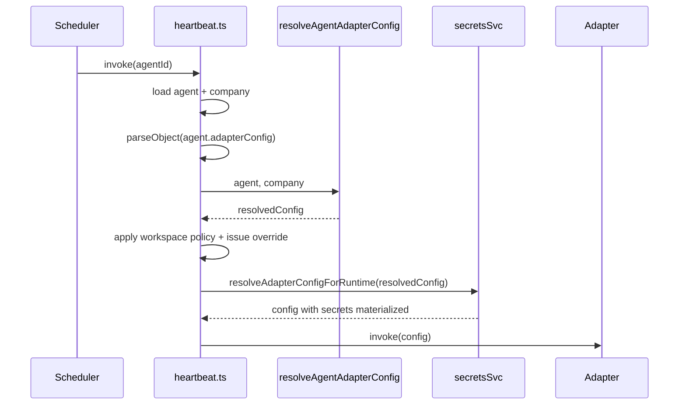

# Paperclip V1 Implementation Spec

Status: Implementation contract for first release (V1)
Date: 2026-02-17
Audience: Product, engineering, and agent-integration authors
Source inputs: `GOAL.md`, `PRODUCT.md`, `SPEC.md`, `DATABASE.md`, current monorepo code

## 1. Document Role

`SPEC.md` remains the long-horizon product spec.
This document is the concrete, build-ready V1 contract.
When there is a conflict, `SPEC-implementation.md` controls V1 behavior.

## 2. V1 Outcomes

Paperclip V1 must provide a full control-plane loop for autonomous agents:

1. A human board creates a company and defines goals.
2. The board creates and manages agents in an org tree.
3. Agents receive and execute tasks via heartbeat invocations.
4. All work is tracked through tasks/comments with audit visibility.
5. Token/cost usage is reported and budget limits can stop work.
6. The board can intervene anywhere (pause agents/tasks, override decisions).

Success means one operator can run a small AI-native company end-to-end with clear visibility and control.

## 3. Explicit V1 Product Decisions

These decisions close open questions from `SPEC.md` for V1.

| Topic | V1 Decision |
|---|---|
| Tenancy | Single-tenant deployment, multi-company data model |
| Company model | Company is first-order; all business entities are company-scoped |
| Board | Single human board operator per deployment |
| Org graph | Strict tree (`reports_to` nullable root); no multi-manager reporting |
| Visibility | Full visibility to board and all agents in same company |
| Communication | Tasks + comments only (no separate chat system) |
| Task ownership | Single assignee; atomic checkout required for `in_progress` transition |
| Recovery | No automatic reassignment; work recovery stays manual/explicit |
| Agent adapters | Built-in `process` and `http` adapters |
| Auth | Mode-dependent human auth (`local_trusted` implicit board in current code; authenticated mode uses sessions), API keys for agents |
| Budget period | Monthly UTC calendar window |
| Budget enforcement | Soft alerts + hard limit auto-pause |
| Deployment modes | Canonical model is `local_trusted` + `authenticated` with `private/public` exposure policy (see `doc/DEPLOYMENT-MODES.md`) |

## 4. Current Baseline (Repo Snapshot)

As of 2026-02-17, the repo already includes:

- Node + TypeScript backend with REST CRUD for `agents`, `projects`, `goals`, `issues`, `activity`
- React UI pages for dashboard/agents/projects/goals/issues lists
- PostgreSQL schema via Drizzle with embedded PostgreSQL fallback when `DATABASE_URL` is unset

V1 implementation extends this baseline into a company-centric, governance-aware control plane.

## 5. V1 Scope

## 5.1 In Scope

- Company lifecycle (create/list/get/update/archive)
- Goal hierarchy linked to company mission
- Agent lifecycle with org structure and adapter configuration
- Task lifecycle with parent/child hierarchy and comments
- Atomic task checkout and explicit task status transitions
- Board approvals for hires and CEO strategy proposal
- Heartbeat invocation, status tracking, and cancellation
- Cost event ingestion and rollups (agent/task/project/company)
- Budget settings and hard-stop enforcement
- Board web UI for dashboard, org chart, tasks, agents, approvals, costs
- Agent-facing API contract (task read/write, heartbeat report, cost report)
- Auditable activity log for all mutating actions

## 5.2 Out of Scope (V1)

- Plugin framework and third-party extension SDK
- Revenue/expense accounting beyond model/token costs
- Knowledge base subsystem
- Public marketplace (ClipHub)
- Multi-board governance or role-based human permission granularity
- Automatic self-healing orchestration (auto-reassign/retry planners)

## 6. Architecture

## 6.1 Runtime Components

- `server/`: REST API, auth, orchestration services
- `ui/`: Board operator interface
- `packages/db/`: Drizzle schema, migrations, DB clients (Postgres)
- `packages/shared/`: Shared API types, validators, constants

## 6.2 Data Stores

- Primary: PostgreSQL
- Local default: embedded PostgreSQL at `~/.paperclip/instances/default/db`
- Optional local prod-like: Docker Postgres
- Optional hosted: Supabase/Postgres-compatible
- File/object storage:
  - local default: `~/.paperclip/instances/default/data/storage` (`local_disk`)
  - cloud: S3-compatible object storage (`s3`)

## 6.3 Background Processing

A lightweight scheduler/worker in the server process handles:

- heartbeat trigger checks
- stuck run detection
- budget threshold checks

Separate queue infrastructure is not required for V1.

## 7. Canonical Data Model (V1)

All core tables include `id`, `created_at`, `updated_at` unless noted.

## 7.0 Auth Tables

Human auth tables (`users`, `sessions`, and provider-specific auth artifacts) are managed by the selected auth library. This spec treats them as required dependencies and references `users.id` where user attribution is needed.

## 7.1 `companies`

- `id` uuid pk
- `name` text not null
- `description` text null
- `status` enum: `active | paused | archived`
- `adapter_defaults` jsonb null — per-provider partial adapter config used as inheritance source (see §22)
- `workspace_root_path` text null — company-level default workspace folder. When set, all projects in this company resolve their working directory under this root unless the project sets its own override. Accepts `~/...` paths (expanded against the heartbeat host's home directory at resolve time). When null, the resolver falls back to `STAPLER_WORKSPACE_ROOT` env or `~/Stapler/<company-slug>/`.

Invariant: every business record belongs to exactly one company.

Shape of `adapter_defaults`:

```ts
// packages/shared/src/types/company.ts
type CompanyAdapterDefaults = {
  [providerId: string]: Partial<AdapterConfig>;
};
```

Keys are adapter type ids (`claude_local`, `codex_local`, `cursor`, `gemini_local`,
`hermes_local`, `http`, `lm_studio_local`, `ollama_local`, `openclaw_gateway`,
`opencode_local`, `pi_local`, `process`). Values are partial adapter configs and
may include `secret_ref` objects; secret refs are treated as leaf values during
merge.

## 7.2 `agents`

- `id` uuid pk
- `company_id` uuid fk `companies.id` not null
- `name` text not null
- `role` text not null
- `title` text null
- `status` enum: `active | paused | idle | running | error | terminated`
- `reports_to` uuid fk `agents.id` null
- `capabilities` text null
- `adapter_type` enum: `process | http` (V1 built-in set; fork ships additional
  local-model adapter types — see §22 for the full list used by the inheritance
  resolver)
- `adapter_config` jsonb not null — stores **explicit overrides only**. Unset
  fields are resolved at runtime from `companies.adapter_defaults[adapter_type]`.
  See §22 for resolution semantics.
- `context_mode` enum: `thin | fat` default `thin`
- `budget_monthly_cents` int not null default 0
- `spent_monthly_cents` int not null default 0
- `last_heartbeat_at` timestamptz null

Invariants:

- agent and manager must be in same company
- no cycles in reporting tree
- `terminated` agents cannot be resumed

## 7.2.1 `teams` and `agent_team_memberships`

Teams are optional delivery groups layered on top of the strict reporting tree.
They support product-squad / pod operation without replacing `agents.reports_to`.

`teams`:

- `id` uuid pk
- `company_id` uuid fk `companies.id` not null
- `name` text not null
- `kind` text not null default `product_squad`
  - expected values: `product_squad | functional | platform | ops | division`
- `parent_team_id` uuid fk `teams.id` null
- `lead_agent_id` uuid fk `agents.id` null
- `status` text not null default `active`

`agent_team_memberships`:

- `id` uuid pk
- `company_id` uuid fk `companies.id` not null
- `team_id` uuid fk `teams.id` not null
- `agent_id` uuid fk `agents.id` not null
- `role_in_team` text not null default `member`
  - expected values: `lead | member | reviewer | owner`
- `is_primary` boolean not null default false

Invariants:

- team, lead, and member agents must belong to the same company
- `parent_team_id` must not create a cycle
- team membership is a soft routing signal; `reports_to` remains the authority for management hierarchy
- delegation routing uses team membership first in matrix/product-squad mode, then reporting line, then role fallback

## 7.3 `agent_api_keys`

- `id` uuid pk
- `agent_id` uuid fk `agents.id` not null
- `company_id` uuid fk `companies.id` not null
- `name` text not null
- `key_hash` text not null
- `last_used_at` timestamptz null
- `revoked_at` timestamptz null

Invariant: plaintext key shown once at creation; only hash stored.

## 7.4 `goals`

- `id` uuid pk
- `company_id` uuid fk not null
- `title` text not null
- `description` text null
- `level` enum: `company | team | agent | task`
- `parent_id` uuid fk `goals.id` null
- `owner_agent_id` uuid fk `agents.id` null
- `status` enum: `planned | active | achieved | cancelled`

Invariant: at least one root `company` level goal per company.

## 7.5 `projects`

- `id` uuid pk
- `company_id` uuid fk not null
- `goal_id` uuid fk `goals.id` null
- `name` text not null
- `description` text null
- `status` enum: `backlog | planned | in_progress | completed | cancelled`
- `lead_agent_id` uuid fk `agents.id` null
- `target_date` date null
- `workspace_path_override` text null — project-level workspace folder override. When set, takes precedence over `companies.workspace_root_path` for this project's resolved cwd. Accepts `~/...` paths. When null, the resolver falls back to the company root (or default).

## 7.6 `issues` (core task entity)

- `id` uuid pk
- `company_id` uuid fk not null
- `project_id` uuid fk `projects.id` null
- `goal_id` uuid fk `goals.id` null
- `parent_id` uuid fk `issues.id` null
- `title` text not null
- `description` text null
- `status` enum: `backlog | todo | in_progress | in_review | done | blocked | cancelled`
- `priority` enum: `critical | high | medium | low`
- `assignee_agent_id` uuid fk `agents.id` null
- `created_by_agent_id` uuid fk `agents.id` null
- `created_by_user_id` uuid fk `users.id` null
- `request_depth` int not null default 0
- `billing_code` text null
- `started_at` timestamptz null
- `completed_at` timestamptz null
- `cancelled_at` timestamptz null

Invariants:

- single assignee only
- task must trace to company goal chain via `goal_id`, `parent_id`, or project-goal linkage
- `in_progress` requires assignee
- terminal states: `done | cancelled`

## 7.7 `issue_comments`

- `id` uuid pk
- `company_id` uuid fk not null
- `issue_id` uuid fk `issues.id` not null
- `author_agent_id` uuid fk `agents.id` null
- `author_user_id` uuid fk `users.id` null
- `body` text not null

## 7.8 `heartbeat_runs`

- `id` uuid pk
- `company_id` uuid fk not null
- `agent_id` uuid fk not null
- `invocation_source` enum: `scheduler | manual | callback`
- `status` enum: `queued | running | succeeded | failed | cancelled | timed_out`
- `started_at` timestamptz null
- `finished_at` timestamptz null
- `error` text null
- `external_run_id` text null
- `context_snapshot` jsonb null

## 7.9 `cost_events`

- `id` uuid pk
- `company_id` uuid fk not null
- `agent_id` uuid fk `agents.id` not null
- `issue_id` uuid fk `issues.id` null
- `project_id` uuid fk `projects.id` null
- `goal_id` uuid fk `goals.id` null
- `billing_code` text null
- `provider` text not null
- `model` text not null
- `input_tokens` int not null default 0
- `output_tokens` int not null default 0
- `cost_cents` int not null
- `occurred_at` timestamptz not null

Invariant: each event must attach to agent and company; rollups are aggregation, never manually edited.

## 7.10 `approvals`

- `id` uuid pk
- `company_id` uuid fk not null
- `type` enum: `hire_agent | approve_ceo_strategy`
- `requested_by_agent_id` uuid fk `agents.id` null
- `requested_by_user_id` uuid fk `users.id` null
- `status` enum: `pending | approved | rejected | cancelled`
- `payload` jsonb not null
- `decision_note` text null
- `decided_by_user_id` uuid fk `users.id` null
- `decided_at` timestamptz null

## 7.11 `activity_log`

- `id` uuid pk
- `company_id` uuid fk not null
- `actor_type` enum: `agent | user | system`
- `actor_id` uuid/text not null
- `action` text not null
- `entity_type` text not null
- `entity_id` uuid/text not null
- `details` jsonb null
- `created_at` timestamptz not null default now()

## 7.12 `company_secrets` + `company_secret_versions`

- Secret values are not stored inline in `agents.adapter_config.env`.
- Agent env entries should use secret refs for sensitive values.
- `company_secrets` tracks identity/provider metadata per company.
- `company_secret_versions` stores encrypted/reference material per version.
- Default provider in local deployments: `local_encrypted`.

Operational policy:

- Config read APIs redact sensitive plain values.
- Activity and approval payloads must not persist raw sensitive values.
- Config revisions may include redacted placeholders; such revisions are non-restorable for redacted fields.

## 7.13 Required Indexes

- `agents(company_id, status)`
- `agents(company_id, reports_to)`
- `issues(company_id, status)`
- `issues(company_id, assignee_agent_id, status)`
- `issues(company_id, parent_id)`
- `issues(company_id, project_id)`
- `cost_events(company_id, occurred_at)`
- `cost_events(company_id, agent_id, occurred_at)`
- `heartbeat_runs(company_id, agent_id, started_at desc)`
- `approvals(company_id, status, type)`
- `activity_log(company_id, created_at desc)`
- `assets(company_id, created_at desc)`
- `assets(company_id, object_key)` unique
- `issue_attachments(company_id, issue_id)`
- `company_secrets(company_id, name)` unique
- `company_secret_versions(secret_id, version)` unique

## 7.14 `assets` + `issue_attachments`

- `assets` stores provider-backed object metadata (not inline bytes):
  - `id` uuid pk
  - `company_id` uuid fk not null
  - `provider` enum/text (`local_disk | s3`)
  - `object_key` text not null
  - `content_type` text not null
  - `byte_size` int not null
  - `sha256` text not null
  - `original_filename` text null
  - `created_by_agent_id` uuid fk null
  - `created_by_user_id` uuid/text fk null
- `issue_attachments` links assets to issues/comments:
  - `id` uuid pk
  - `company_id` uuid fk not null
  - `issue_id` uuid fk not null
  - `asset_id` uuid fk not null
  - `issue_comment_id` uuid fk null

## 7.15 `documents` + `document_revisions` + `issue_documents`

- `documents` stores editable text-first documents:
  - `id` uuid pk
  - `company_id` uuid fk not null
  - `title` text null
  - `format` text not null (`markdown`)
  - `latest_body` text not null
  - `latest_revision_id` uuid null
  - `latest_revision_number` int not null
  - `created_by_agent_id` uuid fk null
  - `created_by_user_id` uuid/text fk null
  - `updated_by_agent_id` uuid fk null
  - `updated_by_user_id` uuid/text fk null
- `document_revisions` stores append-only history:
  - `id` uuid pk
  - `company_id` uuid fk not null
  - `document_id` uuid fk not null
  - `revision_number` int not null
  - `body` text not null
  - `change_summary` text null
- `issue_documents` links documents to issues with a stable workflow key:
  - `id` uuid pk
  - `company_id` uuid fk not null
  - `issue_id` uuid fk not null
  - `document_id` uuid fk not null
  - `key` text not null (`plan`, `design`, `notes`, etc.)

## 8. State Machines

## 8.1 Agent Status

Allowed transitions:

- `idle -> running`
- `running -> idle`
- `running -> error`
- `error -> idle`
- `idle -> paused`
- `running -> paused` (requires cancel flow)
- `paused -> idle`
- `* -> terminated` (board only, irreversible)

## 8.2 Issue Status

Allowed transitions:

- `backlog -> todo | cancelled`
- `todo -> in_progress | blocked | cancelled`
- `in_progress -> in_review | blocked | done | cancelled`
- `in_review -> in_progress | done | cancelled`
- `blocked -> todo | in_progress | cancelled`
- terminal: `done`, `cancelled`

Side effects:

- entering `in_progress` sets `started_at` if null
- entering `done` sets `completed_at`
- entering `cancelled` sets `cancelled_at`

## 8.3 Approval Status

- `pending -> approved | rejected | cancelled`
- terminal after decision

## 9. Auth and Permissions

## 9.1 Board Auth

- Session-based auth for human operator
- Board has full read/write across all companies in deployment
- Every board mutation writes to `activity_log`

## 9.2 Agent Auth

- Bearer API key mapped to one agent and company
- Agent key scope:
  - read org/task/company context for own company
  - read/write own assigned tasks and comments
  - create tasks/comments for delegation
  - report heartbeat status
  - report cost events
- Agent cannot:
  - bypass approval gates
  - modify company-wide budgets directly
  - mutate auth/keys

## 9.3 Permission Matrix (V1)

| Action | Board | Agent |
|---|---|---|
| Create company | yes | no |
| Hire/create agent | yes (direct) | request via approval |
| Pause/resume agent | yes | no |
| Create/update task | yes | yes |
| Force reassign task | yes | limited |
| Approve strategy/hire requests | yes | no |
| Report cost | yes | yes |
| Set company budget | yes | no |
| Set subordinate budget | yes | yes (manager subtree only) |

## 10. API Contract (REST)

All endpoints are under `/api` and return JSON.

## 10.1 Companies

- `GET /companies`
- `POST /companies` — body accepts `name`, `description?`, `budgetMonthlyCents?`, `workspaceRootPath?` (`null` clears, `~/...` allowed)
- `GET /companies/:companyId`
- `PATCH /companies/:companyId` — body accepts the same fields as POST plus governance/branding fields. `workspaceRootPath: null` clears the company default.
- `PATCH /companies/:companyId/branding`
- `POST /companies/:companyId/archive`
- `GET /companies/:companyId/adapter-defaults`
  → `{ [providerId]: Partial<AdapterConfig> }` (all providers)
- `GET /companies/:companyId/adapter-defaults/:providerId`
  → `Partial<AdapterConfig>` (single provider)
- `PUT /companies/:companyId/adapter-defaults/:providerId`
  → replace provider defaults (body fields not present are removed)
- `PATCH /companies/:companyId/adapter-defaults/:providerId`
  → deep-merge provider defaults. Value semantics: key absent = keep; value =
  overwrite; `null` = remove field.
- `DELETE /companies/:companyId/adapter-defaults/:providerId`
  → remove provider defaults entirely

All adapter-defaults endpoints are board-only (enforced by `assertBoard` +
`assertCompanyAccess` in `server/src/routes/adapter-defaults.ts`) and write a
`company.adapter_defaults.updated` activity log entry per mutation. See §22.

## 10.2 Goals

- `GET /companies/:companyId/goals`
- `POST /companies/:companyId/goals`
- `GET /goals/:goalId`
- `PATCH /goals/:goalId`
- `DELETE /goals/:goalId` (soft delete optional, hard delete board-only)

## 10.3 Agents

- `GET /companies/:companyId/agents`
- `POST /companies/:companyId/agents`
- `GET /agents/:agentId`
- `PATCH /agents/:agentId`
- `POST /agents/:agentId/pause`
- `POST /agents/:agentId/resume`
- `POST /agents/:agentId/terminate`
- `POST /agents/:agentId/keys` (create API key)
- `POST /agents/:agentId/heartbeat/invoke`
- `POST /companies/:companyId/agents/bulk-apply` — board-only bulk mutation of
  agent adapter configs across many agents in one transaction. See §22.

`PATCH /agents/:agentId` — value semantics inside `adapterConfig`:

- field `undefined` (key absent): keep existing override
- field = value: set explicit override
- field = `null`: remove override (inherit from company default)

`replaceAdapterConfig: true` preserves the legacy "replace whole config" behavior
and ignores the per-field `null` semantics.

## 10.4 Tasks (Issues)

- `GET /companies/:companyId/issues`
- `POST /companies/:companyId/issues`
- `GET /issues/:issueId`
- `PATCH /issues/:issueId`
- `GET /issues/:issueId/documents`
- `GET /issues/:issueId/documents/:key`
- `PUT /issues/:issueId/documents/:key`
- `GET /issues/:issueId/documents/:key/revisions`
- `DELETE /issues/:issueId/documents/:key`
- `POST /issues/:issueId/checkout`
- `POST /issues/:issueId/release`
- `POST /issues/:issueId/comments`
- `GET /issues/:issueId/comments`
- `POST /companies/:companyId/issues/:issueId/attachments` (multipart upload)
- `GET /issues/:issueId/attachments`
- `GET /attachments/:attachmentId/content`
- `DELETE /attachments/:attachmentId`

### 10.4.1 Atomic Checkout Contract

`POST /issues/:issueId/checkout` request:

```json
{
  "agentId": "uuid",
  "expectedStatuses": ["todo", "backlog", "blocked"]
}
```

Server behavior:

1. single SQL update with `WHERE id = ? AND status IN (?) AND (assignee_agent_id IS NULL OR assignee_agent_id = :agentId)`
2. if updated row count is 0, return `409` with current owner/status
3. successful checkout sets `assignee_agent_id`, `status = in_progress`, and `started_at`

## 10.5 Projects

- `GET /companies/:companyId/projects`
- `POST /companies/:companyId/projects` — body may include `workspacePathOverride?` (`null` to clear)
- `GET /projects/:projectId`
- `PATCH /projects/:projectId` — body may include `workspacePathOverride?` (`null` to clear)
- `GET /projects/:projectId/workspace-path` — returns `{ resolvedAbsolutePath: string, source: "project_override" | "company_root" | "system_default" }` for the project's currently resolved cwd. Same company-access rules as other project endpoints.

## 10.6 Approvals

- `GET /companies/:companyId/approvals?status=pending`
- `POST /companies/:companyId/approvals`
- `POST /approvals/:approvalId/approve`
- `POST /approvals/:approvalId/reject`

## 10.7 Cost and Budgets

- `POST /companies/:companyId/cost-events`
- `GET /companies/:companyId/costs/summary`
- `GET /companies/:companyId/costs/by-agent`
- `GET /companies/:companyId/costs/by-project`
- `PATCH /companies/:companyId/budgets`
- `PATCH /agents/:agentId/budgets`

## 10.8 Activity and Dashboard

- `GET /companies/:companyId/activity`
- `GET /companies/:companyId/dashboard`

Dashboard payload must include:

- active/running/paused/error agent counts
- open/in-progress/blocked/done issue counts
- month-to-date spend and budget utilization
- pending approvals count

## 10.9 Error Semantics

- `400` validation error
- `401` unauthenticated
- `403` unauthorized
- `404` not found
- `409` state conflict (checkout conflict, invalid transition)
- `422` semantic rule violation
- `500` server error

## 11. Heartbeat and Adapter Contract

## 11.1 Adapter Interface

```ts
interface AgentAdapter {
  invoke(agent: Agent, context: InvocationContext): Promise<InvokeResult>;
  status(run: HeartbeatRun): Promise<RunStatus>;
  cancel(run: HeartbeatRun): Promise<void>;
}
```

## 11.2 Process Adapter

Config shape:

```json
{
  "command": "string",
  "args": ["string"],
  "cwd": "string",
  "env": {"KEY": "VALUE"},
  "timeoutSec": 900,
  "graceSec": 15
}
```

Behavior:

- spawn child process
- stream stdout/stderr to run logs
- mark run status on exit code/timeout
- cancel sends SIGTERM then SIGKILL after grace

## 11.3 HTTP Adapter

Config shape:

```json
{
  "url": "https://...",
  "method": "POST",
  "headers": {"Authorization": "Bearer ..."},
  "timeoutMs": 15000,
  "payloadTemplate": {"agentId": "{{agent.id}}", "runId": "{{run.id}}"}
}
```

Behavior:

- invoke by outbound HTTP request
- 2xx means accepted
- non-2xx marks failed invocation
- optional callback endpoint allows asynchronous completion updates

## 11.4 Context Delivery

- `thin`: send IDs and pointers only; agent fetches context via API
- `fat`: include current assignments, goal summary, budget snapshot, and recent comments

## 11.5 Scheduler Rules

Per-agent schedule fields in `adapter_config`:

- `enabled` boolean
- `intervalSec` integer (minimum 30)
- `maxConcurrentRuns` fixed at `1` for V1

Scheduler must skip invocation when:

- agent is paused/terminated
- an existing run is active
- hard budget limit has been hit

## 11.6 Workspace folder resolution

When the heartbeat invokes an adapter and the merged adapter `cwd` is empty
(`undefined`, `""`, or whitespace-only), the server resolves a working
directory using the two-layer policy below and injects it into the runtime
config before adapter execution. If `cwd` is explicitly set, the merged value
wins and resolution is skipped.

Resolution order (first non-empty wins):

1. `projects.workspace_path_override` — project-level explicit folder → source `project_override`
2. `companies.workspace_root_path` joined with the project slug → source `company_root`
3. `STAPLER_WORKSPACE_ROOT` env (or `~/Stapler` when env is unset) joined with `<company-slug>/<project-slug>` → source `system_default`

The resolver returns `{ resolvedAbsolutePath, source }`. `~/...` paths are
expanded against the heartbeat host's home directory. The resolved directory
is best-effort `mkdir -p`'d before adapter spawn; an mkdir failure is logged
as a warning but does not abort the run (the adapter sees the same absolute
path it would otherwise have received).

Slugs are derived deterministically from the entity name (lowercased, ASCII
hyphens, collisions disambiguated with the entity id suffix). The resolver is
exposed at `GET /api/projects/:projectId/workspace-path` for UI preview.

## 12. Governance and Approval Flows

## 12.1 Hiring

1. Agent or board creates `approval(type=hire_agent, status=pending, payload=agent draft)`.
2. Board approves or rejects.
3. On approval, server creates agent row and initial API key (optional).
4. Decision is logged in `activity_log`.

Board can bypass request flow and create agents directly via UI; direct create is still logged as a governance action.

## 12.2 CEO Strategy Approval

1. CEO posts strategy proposal as `approval(type=approve_ceo_strategy)`.
2. Board reviews payload (plan text, initial structure, high-level tasks).
3. Approval unlocks execution state for CEO-created delegated work.

Before first strategy approval, CEO may only draft tasks, not transition them to active execution states.

## 12.3 Board Override

Board can at any time:

- pause/resume/terminate any agent
- reassign or cancel any task
- edit budgets and limits
- approve/reject/cancel pending approvals

## 13. Cost and Budget System

## 13.1 Budget Layers

- company monthly budget
- agent monthly budget
- optional project budget (if configured)

## 13.2 Enforcement Rules

- soft alert default threshold: 80%
- hard limit: at 100%, trigger:
  - set agent status to `paused`
  - block new checkout/invocation for that agent
  - emit high-priority activity event

Board may override by raising budget or explicitly resuming agent.

## 13.3 Cost Event Ingestion

`POST /companies/:companyId/cost-events` body:

```json
{
  "agentId": "uuid",
  "issueId": "uuid",
  "provider": "openai",
  "model": "gpt-5",
  "inputTokens": 1234,
  "outputTokens": 567,
  "costCents": 89,
  "occurredAt": "2026-02-17T20:25:00Z",
  "billingCode": "optional"
}
```

Validation:

- non-negative token counts
- `costCents >= 0`
- company ownership checks for all linked entities

## 13.4 Rollups

Read-time aggregate queries are acceptable for V1.
Materialized rollups can be added later if query latency exceeds targets.

## 14. UI Requirements (Board App)

V1 UI routes:

- `/` dashboard
- `/companies` company list/create
- `/companies/:id/org` org chart and agent status
- `/companies/:id/tasks` task list/kanban
- `/companies/:id/agents/:agentId` agent detail
- `/companies/:id/costs` cost and budget dashboard
- `/companies/:id/approvals` pending/history approvals
- `/companies/:id/activity` audit/event stream

Required UX behaviors:

- global company selector
- quick actions: pause/resume agent, create task, approve/reject request
- conflict toasts on atomic checkout failure
- no silent background failures; every failed run visible in UI
- adapter config fields use the inherit/override pattern (see §22):
  per-field toggle between "inherit from company default" (read-only, shows
  resolved value with company-default badge) and "custom" (editable override).
  Company Settings surfaces a dynamic per-provider "Adapter Defaults" section.
  Provider-scoped and global (cross-provider swap) bulk-apply modals are
  available from Company Settings.

## 15. Operational Requirements

## 15.1 Environment

- Node 20+
- `DATABASE_URL` optional
- if unset, auto-use PGlite and push schema

## 15.2 Migrations

- Drizzle migrations are source of truth
- no destructive migration in-place for V1 upgrade path
- provide migration script from existing minimal tables to company-scoped schema

## 15.3 Logging and Audit

- structured logs (JSON in production)
- request ID per API call
- every mutation writes `activity_log`

## 15.4 Reliability Targets

- API p95 latency under 250 ms for standard CRUD at 1k tasks/company
- heartbeat invoke acknowledgement under 2 s for process adapter
- no lost approval decisions (transactional writes)

## 16. Security Requirements

- store only hashed agent API keys
- redact secrets in logs (`adapter_config`, auth headers, env vars)
- CSRF protection for board session endpoints
- rate limit auth and key-management endpoints
- strict company boundary checks on every entity fetch/mutation

## 17. Testing Strategy

## 17.1 Unit Tests

- state transition guards (agent, issue, approval)
- budget enforcement rules
- adapter invocation/cancel semantics

## 17.2 Integration Tests

- atomic checkout conflict behavior
- approval-to-agent creation flow
- cost ingestion and rollup correctness
- pause while run is active (graceful cancel then force kill)

## 17.3 End-to-End Tests

- board creates company -> hires CEO -> approves strategy -> CEO receives work
- agent reports cost -> budget threshold reached -> auto-pause occurs
- task delegation across teams with request depth increment

## 17.4 Regression Suite Minimum

A release candidate is blocked unless these pass:

1. auth boundary tests
2. checkout race test
3. hard budget stop test
4. agent pause/resume test
5. dashboard summary consistency test

## 18. Delivery Plan

## Milestone 1: Company Core and Auth

- add `companies` and company scoping to existing entities
- add board session auth and agent API keys
- migrate existing API routes to company-aware paths

## Milestone 2: Task and Governance Semantics

- implement atomic checkout endpoint
- implement issue comments and lifecycle guards
- implement approvals table and hire/strategy workflows

## Milestone 3: Heartbeat and Adapter Runtime

- implement adapter interface
- ship `process` adapter with cancel semantics
- ship `http` adapter with timeout/error handling
- persist heartbeat runs and statuses

## Milestone 4: Cost and Budget Controls

- implement cost events ingestion
- implement monthly rollups and dashboards
- enforce hard limit auto-pause

## Milestone 5: Board UI Completion

- add company selector and org chart view
- add approvals and cost pages

## Milestone 6: Hardening and Release

- full integration/e2e suite
- seed/demo company templates for local testing
- release checklist and docs update

## 19. Acceptance Criteria (Release Gate)

V1 is complete only when all criteria are true:

1. A board user can create multiple companies and switch between them.
2. A company can run at least one active heartbeat-enabled agent.
3. Task checkout is conflict-safe with `409` on concurrent claims.
4. Agents can update tasks/comments and report costs with API keys only.
5. Board can approve/reject hire and CEO strategy requests in UI.
6. Budget hard limit auto-pauses an agent and prevents new invocations.
7. Dashboard shows accurate counts/spend from live DB data.
8. Every mutation is auditable in activity log.
9. App runs with embedded PostgreSQL by default and with external Postgres via `DATABASE_URL`.

## 20. Post-V1 Backlog (Explicitly Deferred)

- plugin architecture
- richer workflow-state customization per team
- milestones/labels/dependency graph depth beyond V1 minimum
- realtime transport optimization (SSE/WebSockets)
- public template marketplace integration (ClipHub)

## 21. Company Portability Package (V1 Addendum)

V1 supports company import/export using a portable package contract:

- markdown-first package rooted at `COMPANY.md`
- implicit folder discovery by convention
- `.paperclip.yaml` sidecar for Paperclip-specific fidelity
- canonical base package is vendor-neutral and aligned with `docs/companies/companies-spec.md`
- common conventions:
  - `agents/<slug>/AGENTS.md`
  - `teams/<slug>/TEAM.md`
  - `projects/<slug>/PROJECT.md`
  - `projects/<slug>/tasks/<slug>/TASK.md`
  - `tasks/<slug>/TASK.md`
  - `skills/<slug>/SKILL.md`

Export/import behavior in V1:

- export emits a clean vendor-neutral markdown package plus `.paperclip.yaml`
- projects and starter tasks are opt-in export content rather than default package content
- recurring `TASK.md` entries use `recurring: true` in the base package and Paperclip routine fidelity in `.paperclip.yaml`
- Paperclip imports recurring task packages as routines instead of downgrading them to one-time issues
- export strips environment-specific paths (`cwd`, local instruction file paths, inline prompt duplication) while preserving portable project repo/workspace metadata such as `repoUrl`, refs, and workspace-policy references keyed in `.paperclip.yaml`
- export never includes secret values; env inputs are reported as portable declarations instead
- import supports target modes:
  - create a new company
  - import into an existing company
- import recreates exported project workspaces and remaps portable workspace keys back to target-local workspace ids
- import forces imported agent timer heartbeats off so packages never start scheduled runs implicitly
- import supports collision strategies: `rename`, `skip`, `replace`
- import supports preview (dry-run) before apply
- GitHub imports warn on unpinned refs instead of blocking

## 22. Adapter Config Inheritance

Company-level adapter defaults let the board define a partial adapter config per
provider, and let each agent choose per-field whether to inherit from that
default or carry an explicit override. No schema migration: `companies.adapter_defaults`
already existed as a JSONB column; only the shape and interpretation are extended.

Deeper design context: `doc/llm/adapter-config-inheritance.md`.

## 22.1 Data Model

- `companies.adapter_defaults` (JSONB, see §7.1) holds
  `{ [providerId]: Partial<AdapterConfig> }` across all 12 adapter types:
  `claude_local`, `codex_local`, `cursor`, `gemini_local`, `hermes_local`,
  `http`, `lm_studio_local`, `ollama_local`, `openclaw_gateway`,
  `opencode_local`, `pi_local`, `process`.
- `agents.adapter_config` (JSONB, see §7.2) now stores **only explicit
  overrides**. Unset fields inherit from `companies.adapter_defaults[adapter_type]`
  at runtime.
- Values may be `secret_ref` objects (`{ type: "secret_ref", secretId: "..." }`);
  the resolver treats these as leaves and never recurses into them.
- Backward compatibility: pre-existing `agents.adapter_config` values are
  interpreted as "fully overridden", so Day 1 runtime behavior is unchanged.

## 22.2 Resolution Algorithm

`resolveAgentAdapterConfig(agent, company)` (in
`packages/shared/src/adapter-config.ts`) performs a deep merge of
`company.adapter_defaults[agent.adapter_type]` (defaults) into
`agent.adapter_config` (overrides), with these rules:

- override `undefined` or `null` → keep default (null is dropped at the API
  boundary; it never reaches the resolver)
- override plain object + default plain object → recursive deep merge
- override is a `secret_ref` or default is a `secret_ref` → replace (no recurse)
- override array or scalar → replace wholesale

The helper used internally is `deepMergeAdapterConfig(defaults, overrides)`.



The resolver runs early in `server/src/services/heartbeat.ts` — before
workspace-policy application and issue-level override — so downstream layers all
operate on the inherited config. The final resolved config is then passed to
`secretsSvc.resolveAdapterConfigForRuntime` to materialize `secret_ref` leaves.

## 22.3 REST API

See §10.1 (company adapter defaults) and §10.3 (bulk-apply + `PATCH` `null`
semantics) for endpoint listings. Summary:

- Board-only CRUD on `/companies/:companyId/adapter-defaults[/:providerId]`
- `PATCH /agents/:id` with `null` in an `adapterConfig` field = remove the
  override (agent inherits that field again)
- `POST /companies/:companyId/agents/bulk-apply` performs one transactional
  mutation across many agents

### 22.3.1 Bulk apply modes

`POST /companies/:companyId/agents/bulk-apply` body shape:

```json
{
  "agentIds": ["uuid", "..."],
  "mode": "inherit | override | swap-adapter",
  "fields": ["model", "baseUrl"],
  "overrides": { "model": "llama3.2" },
  "newAdapterType": "ollama_local",
  "newAdapterConfig": { "baseUrl": "...", "model": "..." }
}
```

- `inherit`: clear the fields listed in `fields` from each agent's
  `adapter_config`, so they fall back to company defaults.
- `override`: write the values in `overrides` as explicit overrides on each
  agent.
- `swap-adapter`: replace `adapter_type` and `adapter_config` wholesale on each
  agent (cross-provider migration).

Transactional: single DB transaction, all-or-none rollback. Cross-company agent
ids are rejected (`409`).

## 22.4 Authorization

All adapter-defaults endpoints and `bulk-apply` are gated by `assertBoard` +
`assertCompanyAccess` (`server/src/routes/adapter-defaults.ts`,
`server/src/routes/bulk-apply.ts`). Agent API keys cannot reach these endpoints.

## 22.5 Activity Log

Two actions are written; both keep log volume proportional to operator intent,
not to the number of affected agents:

- `company.adapter_defaults.updated` — one entry per adapter-defaults
  mutation (`PUT`/`PATCH`/`DELETE`). `details` includes `providerId`,
  `changedFields`, `affectedAgentCount`, and `operation`.
- `agent.adapter_config.bulk_applied` — one entry per bulk-apply call.
  `details` includes `agentIds`, `mode`, and a diff summary. Individual
  per-agent log entries are intentionally suppressed (100-agent update = 2
  activity rows, not 101).

## 22.6 UI Primitives

- `<InheritableField>` (`ui/src/components/InheritableField.tsx`): per-field
  inherit/override toggle. In inherit state it renders as a read-only input
  showing the resolved value plus a "company default" badge, with an
  `[Override]` affordance. In override state it renders an editable input plus
  `[Reset to company default]`.
- `<BulkApplyModal>` (`ui/src/components/BulkApplyModal.tsx`) with two variants
  in `ui/src/components/BulkApplyModal/`:
  - `ProviderScopedModal` — triggered from a provider card in Company
    Settings; supports `inherit` and `override` modes for that provider.
  - `GlobalModal` — cross-provider swap-adapter wizard triggered from the top
    of Company Settings.
- Company Settings ("Adapter Defaults" section, `ui/src/pages/CompanySettings.tsx`)
  dynamically renders a card per adapter type (12 cards). Each card reuses the
  adapter's `ui/src/adapters/<id>/config-fields.tsx` in company-defaults edit
  mode.
- The 12 adapter `config-fields.tsx` files all wrap fields in
  `<InheritableField>`. Per-adapter field-level exclusions (for site-specific
  or boolean fields) are documented in the Phase 6 plan.

## 22.7 Constraints

- No destructive schema migration — the JSONB shape extension is
  backward-compatible (§22.1).
- Company scoping enforced on every endpoint; cross-company agent ids in
  `bulk-apply` are rejected.
- Activity log entries are emitted per operator action, never per affected
  agent.
- `bulk-apply` is transactional (all-or-none).
- `secret_ref` objects are leaves during merge and are never cloned into
  a different adapter slot.
