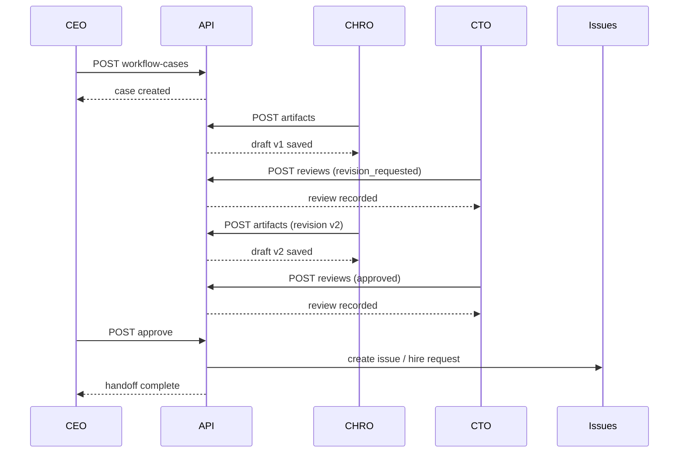

# Workflow Review Routing API Draft

Date: 2026-04-15
Related plans:

- `doc/plans/2026-04-15-workflow-review-routing.md`
- `doc/plans/2026-04-15-workflow-review-routing-schema.md`

## Goal

Define the API surface for workflow-oriented collaboration.

The API should let the board and agents:

- create a workflow case
- route it to the right reviewer role
- add versioned artifacts
- record structured review decisions
- link the outcome to an `issue`, `approval`, or another execution target

The API should feel like the rest of Paperclip:

- company-scoped
- auditable
- role-aware
- explicit about board-only operations

## Design Principles

1. Keep the API company-scoped.
2. Keep `issues` and `approvals` as the execution/governance primitives.
3. Make workflow cases the orchestration primitive.
4. Prefer role-based routing over person-based routing.
5. Write activity log entries for every mutation.
6. Do not let agent auth bypass governance gates.

## Existing Primitives to Reuse

The current control plane already has:

- `issues` for actionable work
- `issue_comments` for human-readable discussion
- `approvals` for explicit board/governance decisions
- `activity_log` for audit
- `agent_messages` for direct agent-to-agent communication

The workflow API should not replace those. It should orchestrate them.

## Proposed Endpoints

### Workflow cases

#### `GET /api/companies/:companyId/workflow-cases`

List workflow cases for a company.

Query params:

- `status`
- `category`
- `kind`
- `requestedByAgentId`
- `linkedIssueId`
- `linkedApprovalId`
- `limit`
- `cursor`

Returns:

```json
{
  "cases": [],
  "pageInfo": {
    "hasNextPage": true,
    "endCursor": null
  }
}
```

#### `POST /api/companies/:companyId/workflow-cases`

Create a new workflow case.

Body:

```json
{
  "kind": "hiring",
  "category": "hiring",
  "title": "Hire Backend Engineer",
  "summary": "Need a backend engineer to help with workflow orchestration.",
  "requestedByAgentId": "uuid",
  "requestedByUserId": "user-id",
  "requestedFromIssueId": "uuid",
  "primaryReviewerRole": "chro",
  "secondaryReviewerRole": "cto",
  "finalApproverRole": "ceo",
  "boardApprovalRequired": false,
  "executionTarget": "agent_hire",
  "priority": "medium",
  "dueAt": "2026-04-20T00:00:00.000Z"
}
```

Notes:

- `category` is required.
- If route rules exist for the category, the server may fill in reviewer roles automatically.
- If the caller provides reviewer roles directly, they must be validated against the company route policy.

Returns:

- the created workflow case

Side effects:

- write `activity_log` entry `workflow_case.created`
- optionally pre-create a board approval placeholder when `boardApprovalRequired = true`

#### `GET /api/companies/:companyId/workflow-cases/:caseId`

Fetch a single workflow case with:

- linked artifacts
- linked reviews
- linked issue / approval references
- route rule snapshot

#### `PATCH /api/workflow-cases/:caseId`

Update a workflow case.

Mutable fields:

- `title`
- `summary`
- `status`
- `primaryReviewerRole`
- `secondaryReviewerRole`
- `finalApproverRole`
- `boardApprovalRequired`
- `priority`
- `dueAt`

Notes:

- company access is checked through the case itself
- status transitions should be validated
- `approved -> executing -> done` should be explicit

#### `POST /api/workflow-cases/:caseId/cancel`

Cancel a workflow case.

Body:

```json
{
  "note": "Not needed anymore"
}
```

### Route rules

#### `GET /api/companies/:companyId/workflow-route-rules`

List routing rules for a company.

#### `POST /api/companies/:companyId/workflow-route-rules`

Create or override a routing rule.

Body:

```json
{
  "category": "engineering",
  "primaryReviewerRole": "cto",
  "secondaryReviewerRole": "ceo",
  "finalApproverRole": "cto",
  "boardApprovalRequired": false,
  "executionTarget": "issue",
  "isEnabled": true
}
```

#### `PATCH /api/workflow-route-rules/:ruleId`

Update a routing rule.

#### `DELETE /api/workflow-route-rules/:ruleId`

Disable or remove a rule.

Recommendation:

- prefer soft-disable via `isEnabled = false`
- keep history for audit

### Artifacts

#### `GET /api/workflow-cases/:caseId/artifacts`

List artifacts for a case, newest first.

#### `POST /api/workflow-cases/:caseId/artifacts`

Create a new artifact version.

Body:

```json
{
  "kind": "draft",
  "title": "CHRO hiring proposal v1",
  "body": "Markdown body here",
  "supersedesArtifactId": "uuid",
  "metadata": {
    "confidence": 0.82
  }
}
```

#### `GET /api/workflow-artifacts/:artifactId`

Fetch a single artifact.

#### `PATCH /api/workflow-artifacts/:artifactId`

Update artifact metadata or content.

Recommendation:

- updates should create a revision unless the artifact is still a draft in the same editing session
- if we want simpler semantics, keep artifacts append-only and make this endpoint only update metadata

### Reviews

#### `POST /api/workflow-cases/:caseId/reviews`

Submit a structured review decision.

Body:

```json
{
  "reviewerRole": "cto",
  "reviewerAgentId": "uuid",
  "status": "revision_requested",
  "decisionNote": "Needs clearer ownership and expected deliverables.",
  "reviewSummary": "The proposal is directionally correct but too vague."
}
```

Notes:

- reviewer role must match the routing rule or an allowed override
- if the reviewer is an agent, the agent must belong to the company
- this should write both workflow review and activity log entries

#### `GET /api/workflow-cases/:caseId/reviews`

List reviews for a case.

#### `POST /api/workflow-cases/:caseId/request-revision`

Convenience endpoint for the common revision case.

Body:

```json
{
  "reviewerRole": "cto",
  "decisionNote": "Please tighten the design constraints."
}
```

### Execution handoff

#### `POST /api/workflow-cases/:caseId/approve`

Mark the case approved and trigger its configured execution target.

Body:

```json
{
  "approverRole": "ceo",
  "decisionNote": "Proceed."
}
```

Expected behavior:

- transition the case to `approved`
- if `executionTarget = issue`, create or update an issue
- if `executionTarget = agent_hire`, create the agent hire flow
- if `boardApprovalRequired = true`, require an approval record before finalizing
- write activity log entries for the approval and the handoff

#### `POST /api/workflow-cases/:caseId/reject`

Reject the workflow case.

Body:

```json
{
  "approverRole": "ceo",
  "decisionNote": "Not a priority right now."
}
```

#### `POST /api/workflow-cases/:caseId/execute`

Explicitly hand off an approved case into the target system.

This endpoint is useful if approval and execution should be separated.

Possible outputs:

- created issue
- created agent hire request
- created approval
- updated agent configuration

Recommendation:

- for V1, keep `approve` and `execute` separate internally, but allow the UI to do both in one click for simple flows

### Activity and comments

#### `GET /api/workflow-cases/:caseId/comments`

Optional if we want a case-specific discussion stream.

If we do add this, it should likely map to `issue_comments` or a new thin wrapper table.

#### `POST /api/workflow-cases/:caseId/comments`

Add a case comment.

Recommendation:

- if we can avoid a new table, use `issue_comments` on the linked issue after the case produces one
- if the case exists before an issue exists, a dedicated comment table or `issue_id = null` strategy may be needed

## Route Summary by Actor

### Board

- can create and edit workflow cases
- can override routing rules
- can approve or reject governed cases
- can see all company cases

### Agent

- can create cases within the company
- can add artifacts and reviews if assigned or authorized
- cannot bypass governance gates
- cannot mutate route rules
- cannot finalize board-only decisions

## Suggested Permission Checks

1. `assertCompanyAccess` for all company-scoped routes.
2. `assertBoard` for route rule mutations and board-only final decisions.
3. Agent auth must verify the agent belongs to the company.
4. Review submission must verify the reviewer role or explicit authorization.
5. Execution handoff must verify the case is approved.

## Activity Log Events

Recommended event names:

- `workflow_case.created`
- `workflow_case.updated`
- `workflow_case.cancelled`
- `workflow_case.artifact_created`
- `workflow_case.artifact_updated`
- `workflow_case.review_submitted`
- `workflow_case.revision_requested`
- `workflow_case.approved`
- `workflow_case.rejected`
- `workflow_case.executed`
- `workflow_route_rule.created`
- `workflow_route_rule.updated`
- `workflow_route_rule.disabled`

## Sequence Example



## Minimal V1 API Set

If we want to start small, the first release should only include:

- `GET /api/companies/:companyId/workflow-cases`
- `POST /api/companies/:companyId/workflow-cases`
- `GET /api/companies/:companyId/workflow-cases/:caseId`
- `GET /api/workflow-cases/:caseId/artifacts`
- `POST /api/workflow-cases/:caseId/artifacts`
- `POST /api/workflow-cases/:caseId/reviews`
- `POST /api/workflow-cases/:caseId/approve`
- `POST /api/workflow-cases/:caseId/reject`
- `GET /api/companies/:companyId/workflow-route-rules`

That is enough to support:

- case creation
- role-based review
- versioned drafts
- final decision
- simple execution handoff

## Open Questions

1. Should `workflow_cases` be public API only, or should agents have direct access to them?
2. Should case comments be a new table, or should we force all discussion through linked issues and artifacts?
3. Should `approve` immediately execute, or should execution always be a separate call?
4. Should route rules be company-level only, or allow agent-specific overrides later?
5. Should we expose a `workflow inbox` endpoint per role for the UI?

## Recommendation

Use the smallest viable API first.

For V1, I would start with:

- case CRUD
- artifact CRUD
- review submit
- approve / reject
- route rules read

Then connect those endpoints to the existing `issues`, `approvals`, and `activity_log` flows instead of inventing a parallel control plane.
