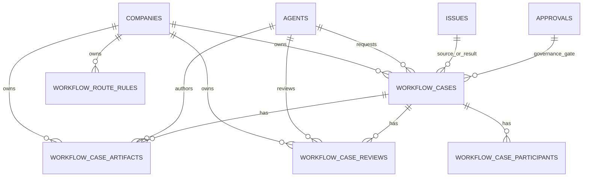

# Workflow Review Routing DB Schema Draft

Date: 2026-04-15
Related plan: `doc/plans/2026-04-15-workflow-review-routing.md`

## Goal

Define the smallest useful database layer for workflow-oriented collaboration:

- categorise the work
- route it to the right reviewer role
- store versioned artifacts
- store structured reviews and decisions
- hand off approved work into existing `issues` / `approvals` / `activity_log`

The design should be additive. It should not replace the current task system.

## Design Principles

1. Keep `issues` as the actionable work primitive.
2. Keep `approvals` as the governed board gate primitive.
3. Keep `activity_log` as the audit trail primitive.
4. Add workflow tables only where the existing schema does not already model the shape cleanly.
5. Prefer `company_id` scope everywhere.
6. Prefer role-based routing over person-based routing.

## Reuse Strategy

This plan intentionally reuses existing tables:

- `issues` for the execution task that eventually comes out of a workflow case
- `approvals` for explicit board or governance gates
- `issue_comments` for conversational back-and-forth when needed
- `activity_log` for immutable audit visibility

The new workflow layer is for orchestration, review, and versioned artifacts.

## Proposed Tables

### 1. `workflow_cases`

Top-level record for a decision flow.

Recommended columns:

- `id` uuid pk
- `company_id` uuid fk `companies.id` not null
- `kind` text not null
- `category` text not null
- `status` text not null default `draft`
- `title` text not null
- `summary` text null
- `requested_by_agent_id` uuid fk `agents.id` null
- `requested_by_user_id` text null
- `requested_from_issue_id` uuid fk `issues.id` null
- `linked_issue_id` uuid fk `issues.id` null
- `linked_approval_id` uuid fk `approvals.id` null
- `primary_reviewer_role` text not null
- `secondary_reviewer_role` text null
- `final_approver_role` text not null
- `board_approval_required` boolean not null default false
- `execution_target` text not null default "issue"
- `priority` text not null default "medium"
- `due_at` timestamptz null
- `started_at` timestamptz null
- `completed_at` timestamptz null
- `cancelled_at` timestamptz null
- `created_at` timestamptz not null default now()
- `updated_at` timestamptz not null default now()

Notes:

- `kind` is a human-friendly workflow family, such as `hiring`, `planning`, `review`.
- `category` is the routing key, such as `engineering`, `hiring`, `budget`, `product_planning`.
- `execution_target` tells the system what the approved workflow should produce, e.g. `issue`, `agent_hire`, `approval`, `config_update`.

### 2. `workflow_case_artifacts`

Versioned outputs produced during the workflow.

Recommended columns:

- `id` uuid pk
- `company_id` uuid fk `companies.id` not null
- `workflow_case_id` uuid fk `workflow_cases.id` on delete cascade
- `kind` text not null
- `version` integer not null
- `title` text not null
- `body` text not null
- `author_agent_id` uuid fk `agents.id` null
- `author_user_id` text null
- `supersedes_artifact_id` uuid fk `workflow_case_artifacts.id` null
- `metadata` jsonb not null default '{}'
- `created_at` timestamptz not null default now()
- `updated_at` timestamptz not null default now()

Notes:

- This table holds the CHRO draft, CTO critique, revised draft, and final recommendation.
- `kind` can be `draft`, `review`, `revision`, `decision`, or `attachment_ref`.
- `metadata` can store rubric scores, reviewer tags, or structured comments.

### 3. `workflow_case_reviews`

Structured review decisions.

Recommended columns:

- `id` uuid pk
- `company_id` uuid fk `companies.id` not null
- `workflow_case_id` uuid fk `workflow_cases.id` on delete cascade
- `artifact_id` uuid fk `workflow_case_artifacts.id` null
- `reviewer_role` text not null
- `reviewer_agent_id` uuid fk `agents.id` null
- `reviewer_user_id` text null
- `status` text not null
- `decision_note` text null
- `review_summary` text null
- `created_at` timestamptz not null default now()
- `updated_at` timestamptz not null default now()

Notes:

- `status` should be one of `approved`, `revision_requested`, `rejected`.
- This is not the same as `approvals`; it is a workflow-specific review result.
- If the workflow requires a board gate, the review may create or reference a separate `approvals` row.

### 4. `workflow_route_rules`

Default routing by category.

Recommended columns:

- `id` uuid pk
- `company_id` uuid fk `companies.id` not null
- `category` text not null
- `primary_reviewer_role` text not null
- `secondary_reviewer_role` text null
- `final_approver_role` text not null
- `board_approval_required` boolean not null default false
- `execution_target` text not null
- `is_enabled` boolean not null default true
- `created_at` timestamptz not null default now()
- `updated_at` timestamptz not null default now()

Notes:

- A company can override the default route for a category.
- The UI should show the current route rule beside the case so the operator can see why the workflow was routed that way.

### Optional 5. `workflow_case_participants`

Use this only if we need explicit assignees/reviewers beyond role routing.

Recommended columns:

- `id` uuid pk
- `company_id` uuid fk `companies.id` not null
- `workflow_case_id` uuid fk `workflow_cases.id` on delete cascade
- `role` text not null
- `participant_agent_id` uuid fk `agents.id` null
- `participant_user_id` text null
- `kind` text not null
- `created_at` timestamptz not null default now()

Notes:

- This table is optional for V1.
- If the route rule is enough, we do not need it yet.

## Relationship Diagram

## Status Model

Recommended workflow case statuses:

- `draft`
- `in_review`
- `revision_requested`
- `approved`
- `rejected`
- `executing`
- `done`
- `cancelled`

These should map cleanly to the UI and to board-visible summaries.

## Index Draft

Recommended indexes:

- `workflow_cases(company_id, status, category)`
- `workflow_cases(company_id, requested_by_agent_id, status)`
- `workflow_cases(company_id, linked_issue_id)`
- `workflow_cases(company_id, linked_approval_id)`
- `workflow_case_artifacts(company_id, workflow_case_id, version desc)`
- `workflow_case_artifacts(company_id, author_agent_id, created_at desc)`
- `workflow_case_reviews(company_id, workflow_case_id, created_at desc)`
- `workflow_case_reviews(company_id, reviewer_role, status)`
- `workflow_route_rules(company_id, category)` unique

## Data Flow

### Hiring case

1. CEO creates a `workflow_case` with `category = hiring`.
2. CHRO creates the first `workflow_case_artifact`.
3. CTO adds a `workflow_case_review` if technical fit needs review.
4. CEO approves the final state.
5. The system creates or updates the real `issue` / `agent` record.
6. Activity entries are written for each mutation.

### Technical plan case

1. CEO or engineer creates a `workflow_case` with `category = engineering`.
2. CTO reviews the first draft.
3. If needed, CTO requests revision and a new artifact version is created.
4. Once approved, the workflow links to an execution `issue`.

### Budget case

1. CFO reviews the request.
2. If the case exceeds policy thresholds, a board approval is created.
3. When approved, the case transitions to `approved` or `executing`.

## Why Not Put This All in `approvals`?

Because `approvals` is already a governed gate, not the full workflow.

What `approvals` does well:

- pending/approved/rejected gate
- payload snapshot
- decision note
- explicit decision actor

What it does not yet model well:

- multiple drafts
- role-based routing
- intermediate review loops
- structured artifacts
- a case that eventually becomes an issue, hire, or config update

So the better split is:

- `workflow_cases` = the process
- `workflow_case_artifacts` = the versions
- `workflow_case_reviews` = the review outcomes
- `approvals` = the explicit board/governance gate

## Migration Order

Recommended order:

1. Add `workflow_cases`
2. Add `workflow_case_artifacts`
3. Add `workflow_case_reviews`
4. Add `workflow_route_rules`
5. Add minimal UI/API around read-only browsing
6. Wire case completion into existing issue / approval flows

## V1 Scope

Start with:

- `engineering`
- `hiring`
- `budget`
- `product_planning`
- `strategy_planning`

Start with only these review outcomes:

- `approved`
- `revision_requested`
- `rejected`

Defer:

- explicit participants table
- advanced scoring
- multi-stage reviewer chains
- custom company-defined state machines

## Open Questions

1. Should `workflow_cases` link to one primary `issue`, or be allowed to fan out to multiple issues later?
2. Should `workflow_case_reviews` record one canonical reviewer per case, or allow multiple reviewers per stage?
3. Should route rules be seeded per company template, or derived from company role names?
4. Should the case model become the default surface in the agent detail UI immediately, or only for routed cases?

## Recommendation

Use this as a thin orchestration layer above the current control plane.
Do not try to replace `issues` or `approvals`.
The new layer should explain the decision flow and route the work, then hand off to the existing primitives once the decision is made.
