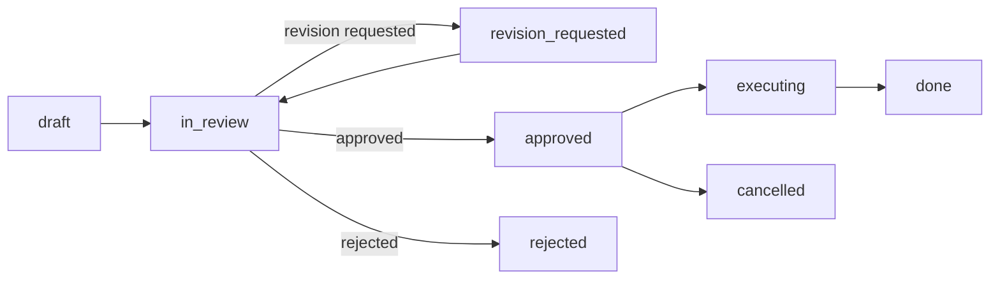

# Workflow Review Routing Plan

Date: 2026-04-15

## Goal

Model agent collaboration as a structured workflow instead of free-form chat.
The product should explain:

- what kind of work this is
- who should review it
- what version is being reviewed
- why the decision was made
- what happens after approval

This keeps the control plane aligned with Paperclip's task/comment/approval model while still making agent collaboration easy to follow.

## Core Idea

Replace "chat as the main primitive" with a workflow case that owns:

- the request
- the draft/proposal
- the review
- the final decision
- the execution handoff

Free-form messages can still exist, but they are secondary to the workflow record.

## Why This Is Needed

The current system already has:

- issues and comments
- approvals
- activity logs
- heartbeats and execution logs
- agent-to-agent messages

What it does not yet have is a first-class object for:

- "this is a hiring case"
- "this is a product planning case"
- "CTO should review this, not CHRO"
- "this draft was revised twice before approval"

That missing layer is what makes the process hard to reason about today.

## Proposed Model

### 1. Workflow case

A workflow case is the top-level unit for a decision flow.

Examples:

- hire a backend engineer
- review a technical plan
- approve a budget increase
- draft a product roadmap

Each case has:

- `companyId`
- `kind`
- `category`
- `title`
- `summary`
- `status`
- `requestedByAgentId`
- `requestedByUserId`
- `primaryReviewerRole`
- `secondaryReviewerRole`
- `finalApproverRole`
- `linkedIssueId` or `linkedApprovalId`
- timestamps

### 2. Workflow artifact

Artifacts are versioned outputs produced during the workflow.

Examples:

- CHRO hiring proposal v1
- CTO critique v1
- revised roadmap v2

Each artifact has:

- `workflowCaseId`
- `kind` (`draft`, `review`, `revision`, `decision`, `attachment`)
- `version`
- `title`
- `body`
- `authorAgentId`
- `authorUserId`
- `metadata`

### 3. Workflow review

Reviews are structured decisions, not just comments.

Each review has:

- `workflowCaseId`
- `reviewerRole`
- `reviewerAgentId`
- `status` (`approved`, `revision_requested`, `rejected`)
- `decisionNote`
- `targetsArtifactId`
- `createdAt`

### 4. Workflow route rule

Routing rules map a work category to a review chain.

Each rule has:

- `category`
- `primaryReviewerRole`
- `secondaryReviewerRole`
- `finalApproverRole`
- `boardApprovalRequired`
- `executionTarget`

## Category Map

| Category | Meaning | Primary reviewer | Secondary reviewer | Final approver |
| --- | --- | --- | --- | --- |
| `engineering` | Code, infra, architecture, technical execution | CTO | CEO | CTO or CEO |
| `hiring` | Hiring, org structure, role creation | CHRO | CTO | CEO |
| `product_planning` | Product direction, roadmap, feature prioritization | CPO or CEO | CTO | CEO |
| `strategy_planning` | Company strategy, new bets, major direction changes | CEO | CFO, CTO | CEO or board |
| `execution_planning` | Delivery planning, sequencing, operational rollout | COO | CTO | COO or CEO |
| `tech_planning` | System design, infrastructure planning, platform choices | CTO | CEO | CTO or CEO |
| `budget` | Spend, ROI, budget expansion, burn policy | CFO | CEO | CEO or board |
| `marketing` | Messaging, campaigns, growth creative | CMO | CEO | CEO |
| `operations` | Operating policy, repeatable process, runbook changes | COO | CHRO, CTO | COO or CEO |
| `governance` | Permission, approval policy, risk, control-plane decisions | CEO | board | board or CEO |
| `general` | Unclassified or mixed work | Closest C-level | Optional specialist | CEO |

## Decision Rules

1. The workflow must always be categorized.
2. Category determines the default review route.
3. Review roles are role-based, not person-based.
4. A case may have multiple reviewers if the work crosses domains.
5. Final approver may be different from the first reviewer.
6. The board gate is optional and explicit, not implicit.
7. "Chat" is never the source of truth for the decision.

## Status Model

Recommended statuses for workflow cases:

- `draft`
- `in_review`
- `revision_requested`
- `approved`
- `rejected`
- `executing`
- `done`
- `cancelled`

Recommended transitions:

## UI Plan

The current agent detail screen should evolve from a chat-like view into a workflow-oriented view.

### Tabs

- `Overview`
- `Instructions`
- `Workflow`
- `Runs`
- `Budget`

### Workflow tab contents

- case list
- selected case detail
- current status and reviewer chain
- latest artifact version
- review decision cards
- execution handoff
- raw transcript/log section collapsed below

### What to hide by default

- stdout noise
- raw tool call dumps
- internal prompt text

Those remain available, but they should be secondary to the workflow case.

## Data Model Direction

This design should reuse the existing control-plane objects instead of replacing them.

### Reuse

- `issues` for the underlying task object when the workflow becomes actionable
- `approvals` for explicit board or governed decisions
- `activity_log` for auditability
- `issue_comments` for human-readable discussion

### Add

- `workflow_cases`
- `workflow_case_artifacts`
- `workflow_case_reviews`
- `workflow_route_rules`

### Optional later

- `workflow_case_events`
- `workflow_case_links`
- `workflow_case_participants`

## Example Flows

### Hiring a backend engineer

1. CEO opens a hiring case.
2. CHRO drafts the hiring proposal.
3. CTO reviews whether the role definition is technically sensible.
4. CEO approves the final version.
5. The system creates the hire / issue / onboarding task.

### Reviewing a technical plan

1. CEO or engineer opens an engineering case.
2. CTO reviews the first draft.
3. CTO requests revision or approves.
4. If approved, the case becomes an execution task.

### Budget increase

1. CFO reviews the request.
2. CEO decides whether the spend is worth it.
3. If needed, board approval becomes a separate explicit gate.

## Implementation Order

1. Add the workflow case data model.
2. Add route rules for the first V1 categories.
3. Expose workflow case APIs.
4. Add a workflow-focused agent detail UI.
5. Connect approved cases to issue creation, hiring, or config updates.
6. Keep raw execution logs in the runs view.

## V1 Scope

Start with only these categories:

- `engineering`
- `hiring`
- `budget`
- `product_planning`
- `strategy_planning`

Start with only these review outcomes:

- `approved`
- `revision_requested`
- `rejected`

Keep free-form agent messaging as an auxiliary tool, not the main UI surface.

## Open Questions

1. Should workflow cases be their own top-level table, or should they attach to `issues` from day one?
2. Should `approval` remain the final board gate, or should workflow cases gain a dedicated decision table?
3. Should the agent detail page default to `Workflow` instead of `Overview` for active cases?
4. Should the `messages` tab be removed entirely once workflow cases exist?

## Recommendation

For V1, add workflow cases as a thin layer above the existing task and approval model.
That gives us:

- structured review routing
- versioned drafts
- explicit decisions
- better UI clarity
- minimal disruption to the current control plane

The main product shift is not "add chat." It is "make decisions first-class."
